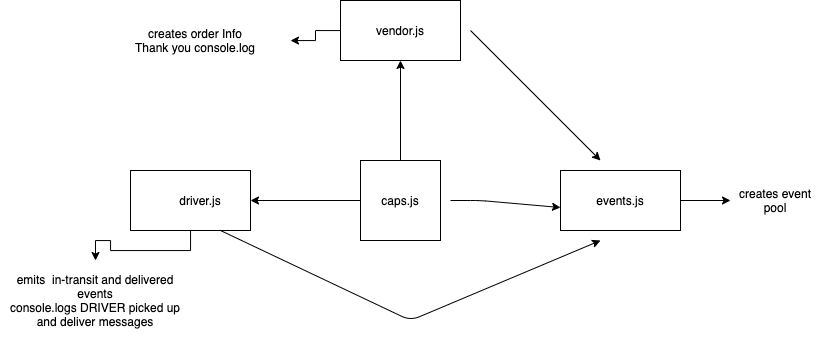

# caps

### Author: Emad Idris ✌✌

### Start
```
npm start
```

#### Tests

To run tests:

`npm test`

### Sample Output
```
  event: 'pickup',
  dateee: 'Mon Nov 15 2021 17:37:45 GMT+0200 (Eastern European Standard Time)',
  payload: {
    orderStore: 'Carfour',
    orderId: 'a8e0a56a-f97a-4c63-aa02-fede5e843c8f',
    orderCustomer: 'Gail Aufderhar V',
    orderAddress: 'Adeliaberg,944 Colby Summit'
  }
}
DRIVER : picked up a8e0a56a-f97a-4c63-aa02-fede5e843c8f
EVENT {
  event: 'in-transit',
  dateee: 'Mon Nov 15 2021 17:37:46 GMT+0200 (Eastern European Standard Time)',
  payload: {
    orderStore: 'Carfour',
    orderId: 'a8e0a56a-f97a-4c63-aa02-fede5e843c8f',
    orderCustomer: 'Gail Aufderhar V',
    orderAddress: 'Adeliaberg,944 Colby Summit'
  }
}
DRIVER: deliverd up a8e0a56a-f97a-4c63-aa02-fede5e843c8f
Thank you, a8e0a56a-f97a-4c63-aa02-fede5e843c8f
EVENT {
  event: 'delivered',
  dateee: 'Mon Nov 15 2021 17:37:48 GMT+0200 (Eastern European Standard Time)',
  payload: {
    orderStore: 'Carfour',
    orderId: 'a8e0a56a-f97a-4c63-aa02-fede5e843c8f',
    orderCustomer: 'Gail Aufderhar V',
    orderAddress: 'Adeliaberg,944 Colby Summit'
  }
}
```
# UML

